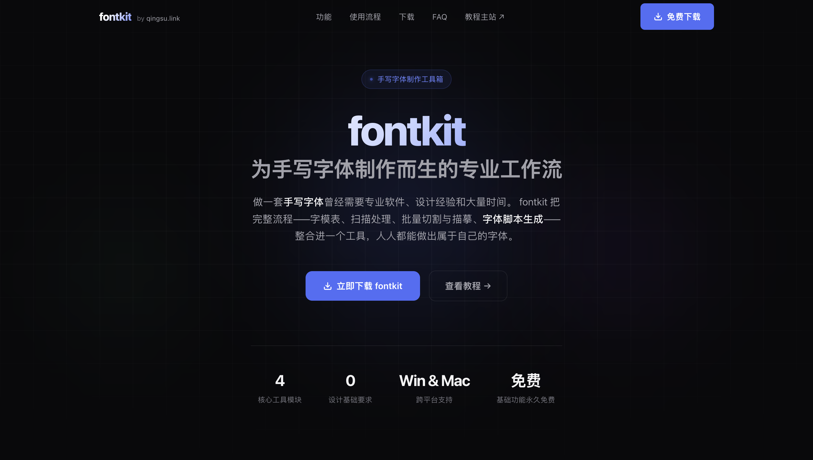
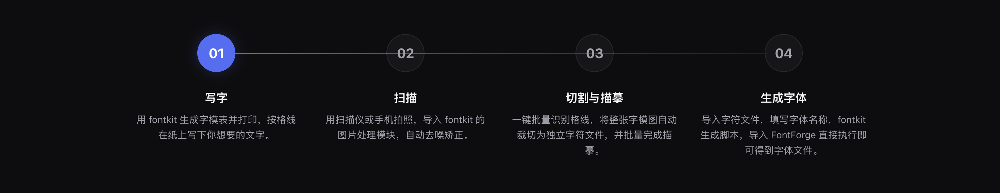
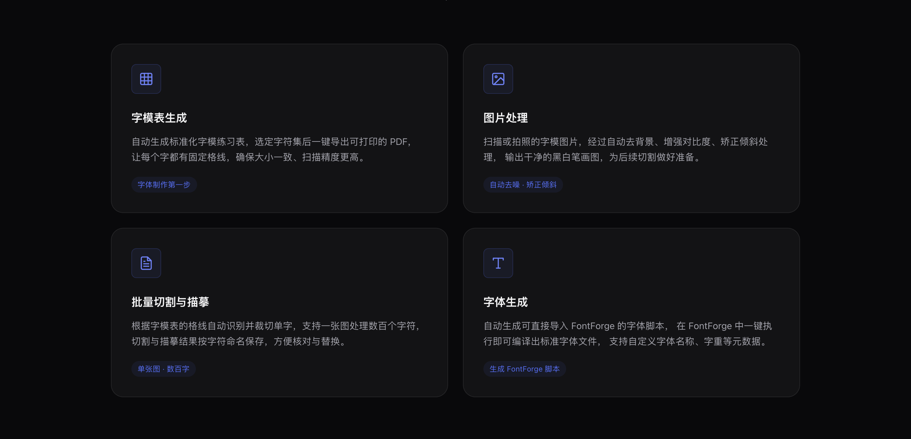

  

  <h1>fontkit</h1>

  
<strong>Turn your handwriting into a real font file.</strong>

  
Free · Cross-platform · Zero design experience required · Win &amp; macOS

  

    
    
    
  

  

    <a href="./README.md">中文</a> ·
    <strong>English</strong>
  

---

## What is fontkit?

**fontkit is a desktop toolkit purpose-built for handwriting font creation.**

You write your characters once on paper. fontkit handles everything else — scanning, cleanup, batch slicing, and exporting a real `.ttf` file you can install and use anywhere.

> AI font generators give you a font that *resembles* someone. fontkit gives you a font that *is* you.

## Why not just use an AI font generator?

|                       | AI Font Generators                  | fontkit                    |
| --------------------- | ----------------------------------- | -------------------------- |
| **Authentic strokes** | ❌ Model's guess                    | ✅ 100% your handwriting   |
| **Style consistency** | Different result every time         | Every glyph is fixed       |
| **Commercial rights** | Murky, often unclear                | Yours, completely          |
| **Reproducibility**   | Anyone can re-generate "your" font  | Truly one-of-a-kind        |
| **Price**             | Mostly paid or rate-limited         | Free                       |

## How it works — 4 steps

1. **Write** — Generate a printable grid template, fill it in by hand
2. **Scan** — Use a scanner or your phone; fontkit auto-denoises &amp; deskews
3. **Slice** — A single sheet, hundreds of characters, sliced in one click
4. **Generate** — Outputs a FontForge script that compiles a standard `.ttf`

## Features

- **Grid Template Generator** — One-click printable PDF, ready to write on
- **Image Processing** — Auto background removal, deskew, contrast boost
- **Batch Slicing** — Auto-detect grid lines, extract every glyph cleanly
- **Font Compilation** — Generate a FontForge script, compile a real `.ttf`

## Who is it for?

- **Complete beginners** — Never made a font before, don't want to learn complex software
- **Side-hustlers** — Turn your handwriting into a sellable product
- **Designers &amp; creators** — Personal branding, illustration, journaling — own a font no one else has

## Download

| Platform | Download                                                                              |
| -------- | ------------------------------------------------------------------------------------- |
| Windows  | [Baidu Netdisk](https://pan.baidu.com/s/1D4ZX7ZAJheduW5YlYfUHow?pwd=5d45)            |
| macOS    | [Baidu Netdisk](https://pan.baidu.com/s/1D4ZX7ZAJheduW5YlYfUHow?pwd=5d45)            |

> Core features are free forever. Full tutorial at [qingsu.link](https://qingsu.link).

## Tutorial &amp; Demo

- [Full walkthrough on Bilibili](https://www.bilibili.com/video/BV1NPoKBPEfY/)
- [Step-by-step tutorial — qingsu.link](https://qingsu.link)
- [Product website — fontkit.qingsu.link](https://fontkit.qingsu.link)

## FAQ

<strong>I have zero design experience. Can I really use this?</strong>

 
Absolutely. fontkit is built for total beginners. You don't need to know anything about PostScript, Bezier curves, or font internals. If you can write and take a photo, you can make a font.

<strong>Which operating systems are supported?</strong>

 
Windows 10+ and macOS 11 Big Sur+. Both versions have feature parity.

<strong>Can I use the resulting font commercially?</strong>

 
Yes. The handwriting is yours, and so is the font. Full rights belong to you.

<strong>Is fontkit open source?</strong>

 
fontkit is closed-source but free to use. This repository is used for release announcements, user feedback, and Q&amp;A. Got a feature request or bug report? Open an <a href="../../issues">Issue</a> — we read every one.

## Feedback &amp; Requests

Found a bug? Have an idea for a feature?  
Drop it in [Issues](../../issues) — every report gets a response.

---

  
If fontkit helps you, a ⭐ Star is the best way to say thanks.

  
Made with ❤ by <a href="https://qingsu.link">qingsu.link</a>

